Approach-avoidance reinforcement learning
================
Yumeya Yamamori
2024-04-28

Analyses demo for the paper:  
Approach-avoidance reinforcement learning; a computational and
translational model of anxiety-related avoidance (2023)  
Yamamori, Y; Robinson, OJ\*; Roiser, JP\*.  
\* These authors contributed equally to this research
<https://doi.org/10.7554/eLife.87720.4>

In this study, we developed a novel translational measure of
anxiety-related avoidance in the form of an approach-avoidance
reinforcement learning task. The task was an adaptation of a paradigm
from the non-human animal literature to study the same processes of
approach-avoidance in human participants. In a large online study (n =
372), we found that participants who experienced greater anxiety during
the task avoided choices associated with punishment, even when this
resulted in lower overall reward. Here we demonstrate the statistical
analyses behind these findings, including computational modelling of
behaviour to probe the putative cognitive mechanisms underlying the bias
to avoid choices associated with punishment under anxiety.

## Set-up

### Load packages and settings

To run these analyses yourself, you will need to install the following
packages.

``` r
# General
library(tidyverse)

# Reading in MATLAB files
library(R.matlab)

# Plotting
library(ggpubr)
library(GGally)
library(cowplot)

theme_set(theme_pubclean())
theme_update(panel.grid.major.y = element_blank())

# Nice colours
library(viridis)
myColours = c('#008A8A', '#8B0000', '#CA7933')

# Regressions
library(lmerTest)
library(parameters)
library(sjPlot)

# Structural equation modelling
library(lavaan)

# Permutation tests
library(wPerm)

# Intra-class correlations
library(irr)

# set a random number seed for reproducibility
set.seed(1234)
```

### Load our task settings and data

We conducted two studies: an initial discovery study (n = 372) where we
investigated how anxiety affects behaviour in our novel task, and a
subsequent replication study (n = 627) where we assessed the
replicability of the findings. The key behavioural findings replicated
in the latter study, so we mainly present findings from the former here.
The replication sample data is included with the data here (and at
<https://osf.io/8dm95>), and you can easily adapt the code to show the
results for the replication sample. A full comparison of all
results/findings across studies is presented in the Supplementary
Materials of our paper.

Also, while we excluded some participants due to data quality (missed
attention checks, missed trials, etc.), these exclusions did not have a
material impact on the results (again, see the Supplementary Materials).
For the sake of brevity, we only analyses after excluding these
participants here, but the data from all participants prior to
exclusions can be found online at <https://osf.io/8dm95>.

``` r
# the latent outcome probability walks used in the study
walks         = read_csv('data/random_walks.csv')

# the behavioural task data, including task-induced anxiety and symptoms
task_data     = read_csv('data/task_data.csv')

# individual parameters from the winning model
params        = read_csv('data/parameters.csv')

# choice data with computational model predictions for each choice
ppc_data      = read_csv('data/ppc_data.csv')

# the test-retest behavioural data
trt_data      = read_csv('data/test_retest_data.csv')

# individual parameters from the winning test-retest model
trt_params    = read_csv('data/test_retest_parameters.csv')

# the fitted model from matlab for reliability analysis
trt_model     = readMat('data/llj2a2b.mat')
```

## The approach-avoidance reinforcement learning task

In our study, participants completed a reinforcement learning task in
which their goal was to accrue monetary rewards whilst avoiding
affective punishments. On each of 200 trials, they chose one of two
options. Choices were associated with four possible outcomes: a monetary
reward (represented by a coin); an aversive sound consisting of a
combination of a female scream and a high-pitched sound; both the reward
and aversive sound; or no reward and no sound.


The options were asymmetric in their associated outcomes. The ‘conflict’
option was associated with both the reward and aversive sound, whereas
the ‘safe’ option was only associated with the reward. In other words,
choosing the conflict option could result in any of the four possible
outcomes on any given trial, but the safe option could only lead to
either the reward or no reward, and never the aversive sounds.
Participants were not informed about this asymmetric feature of the
task.


On average, the safe option was less likely to produce the reward
compared to the conflict option across the task. The probability of
observing the reward and the aversive sound at each option fluctuated
randomly and independently over trials, except the probability of
observing the aversive sound at the safe option, which was set to 0
across all trials. Therefore, we induced an approach-avoidance conflict
between the options as the conflict option was generally more rewarding
but also more likely to result in punishment. Participants were told
that the probabilities of observing the reward or the sound were
independent and that they could change across trials.

This was one of the sets of outcome probability walks used in the study:

``` r
walks %>% 
  filter(walk == 3) %>% 
  pivot_longer(contains('_')) %>% 
  mutate(
    Outcome = ifelse(str_detect(name, 'pun'), 'Punish', 'Reward') %>% fct_relevel('Reward'),
    Option = ifelse(str_detect(name, 'safe'), 'Safe', 'Conflict')
  ) %>% 
  ggplot(aes(trial, value)) + 
  facet_wrap(~ walk, labeller = label_both) + 
  geom_line(aes(colour = Outcome, linetype = Option)) + 
  scale_colour_manual(values = myColours) + 
  labs(x = 'Trial', y = 'P(outcome)')
```

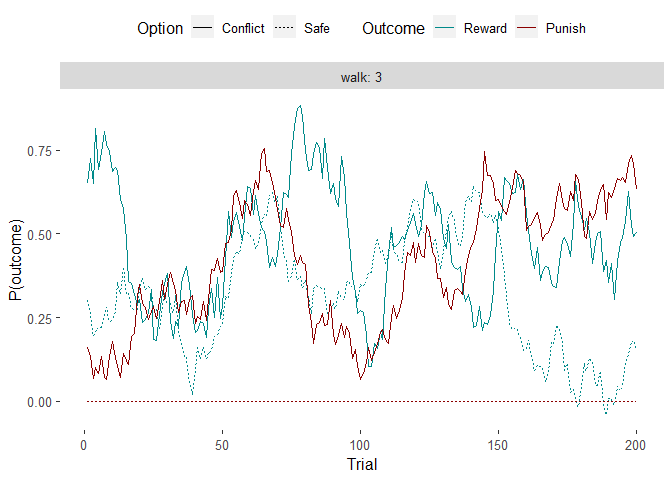<!-- -->

------------------------------------------------------------------------

By collapsing across trials, it is easier to see that the average
probability of getting a reward at the conflict option is higher than at
the safe option. However, it is also the only option with non-zero
probabilities of producing a punishment.

``` r
walks %>% 
  filter(walk == 3) %>% 
  pivot_longer(contains('_')) %>% 
  mutate(
    Outcome = ifelse(str_detect(name, 'pun'), 'Punish', 'Reward') %>% fct_relevel('Reward'),
    Option = ifelse(str_detect(name, 'safe'), 'Safe', 'Conflict')
  ) %>% 
  ggplot(aes(Option, value)) + 
  geom_violin(aes(colour = Outcome), position = position_dodge(0.8)) + 
  geom_point(aes(colour = Outcome), alpha = 1/4, position = position_jitterdodge(dodge.width = 0.8, jitter.width = 0.5)) + 
  stat_summary(aes(group = Outcome), position = position_dodge(0.8)) + 
  scale_colour_manual(values = myColours, aesthetics = c('fill', 'colour')) + 
  theme(legend.position = 'none') + 
  labs(x = 'Option', y = 'Outcome probability')
```

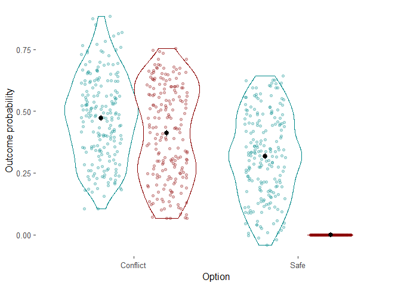<!-- -->

## Simple visualisations of behaviour

Here are some examples of participants’ responses and observed outcomes
on a trial-by-trial basis. Each pair of rows is the trial-by-trial
choice and outcome data from one participant. A filled box in the upper
row of each pair of rows indicates a conflict option choice, whereas one
in the lower row indicates a safe option choice. The colour of the box
indicates which outcome they saw on that trial.

``` r
task_data %>% 
  filter(
    subject_nr %in% (task_data$subject_nr %>% unique %>% sample(10)),
    trial <= 100
  ) %>% 
  mutate(
    Outcome = case_when(
      reward == 1 & punish == 0 ~ 'Reward',
      reward == 0 & punish == 1 ~ 'Punishment',
      reward == 1 & punish == 1 ~ 'Both',
      TRUE ~ 'None'),
    choice = 3 - choice
  ) %>% 
  ggplot(aes(trial, choice)) + 
  facet_wrap(~ subject_nr, ncol = 1, strip.position = 'left') + 
  geom_raster(aes(fill = Outcome)) + 
  scale_y_discrete(breaks = NULL) + 
  scale_fill_manual(
    breaks = c('Reward', 'Punishment', 'Both', 'None'),
    values = c(myColours[1], myColours[2], myColours[3], 'Grey80')
  ) +
  coord_fixed() + 
  labs(x = 'Trial', y = 'Choice (upper = conflict; lower = safe)')
```

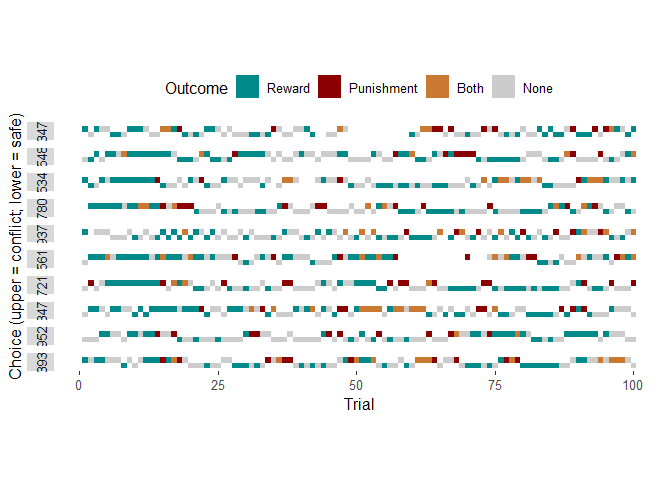<!-- -->

------------------------------------------------------------------------

We can see that the task involved approach-avoidance conflict from the
positive correlation of mean rewards and punishments observed by each
individual. That is, the more rewards a participant received, the more
punishments they incurred.

``` r
task_data %>% 
  filter(study == 'disc') %>% 
  group_by(subject_nr) %>% 
  summarise(across(reward:punish, mean, na.rm = T)) %>% 
  ggplot(aes(reward, punish), data = .) + 
  geom_point(alpha = 0.8) + 
  geom_smooth(method = 'lm', colour = myColours[2], fill = myColours[2]) + 
  stat_cor() + 
  theme(aspect.ratio = 1) + 
  labs(x = 'Mean reward', y = 'Mean punishment')
```

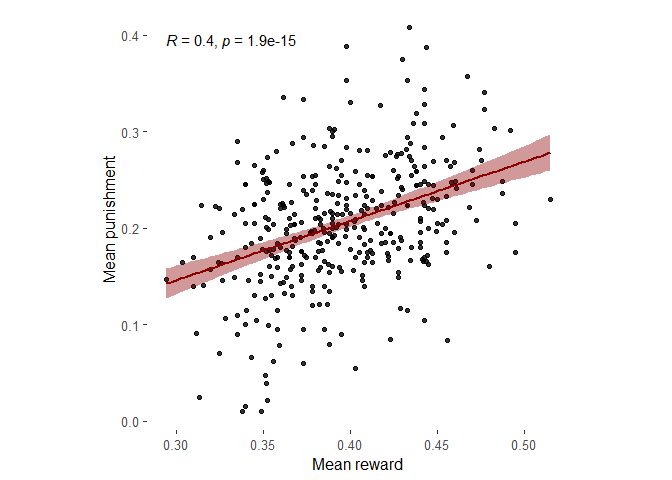<!-- -->

This effect is actually stronger if we use the raw probability values to
obtain *potential* reward and *potential* punishment, since the
stochasticity of the outcomes makes things a bit more noisy/complicated.

``` r
task_data %>% 
  filter(study == 'disc') %>% 
  left_join(walks) %>% 
  mutate(
    reward = ifelse(choice == 1, rew_conf, rew_safe),
    punish = ifelse(choice == 1, pun_conf, pun_safe)
  ) %>% 
  group_by(subject_nr) %>% 
  summarise(across(reward:punish, mean, na.rm = T)) %>% 
  ggplot(aes(reward, punish), data = .) + 
  geom_point(alpha = 0.8) + 
  geom_smooth(method = 'lm', colour = myColours[2], fill = myColours[2]) + 
  stat_cor() + 
  theme(aspect.ratio = 1) + 
  labs(x = 'Mean potential reward', y = 'Mean potential punishment')
```

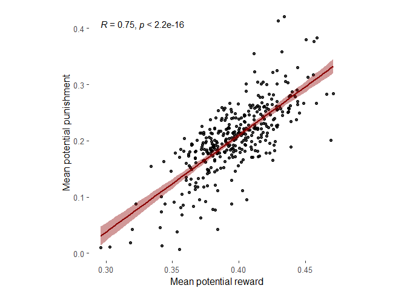<!-- -->

## Predictors of trial-by-trial choices in the task

### Choices reflect both approach and avoidance

We verified that participants demonstrated both approach and avoidance
responses during the task through a hierarchical logistic regression
model, in which we used the latent outcome probabilities to predict
trial-by-trial choice. ‘Approach’ and ‘avoidance’ predictors were
constructed by taking the difference in probabilities of observing
reward and punishment, respectively, across the options, on each trial:

$\delta P(Reward) = P(Reward|Conflict) - P(Reward|Safe)$

$\delta P(Punishment) = P(Punishment|Conflict) - P(Punishment|Safe)$

(Note that in the paper, we discuss $\delta P(Punishment)$ in terms of
only $P(Punishment | conflict)$, but they are identical since
$P(Punishment | safe) = 0$. The present notation just allows this
analyses to be extended to cases where the safe option has some
punishment probability.)

We specified the model hierarchy by clustering by participant. The
hierarchical logistic regression model was therefore:

$choice \sim \delta P(Reward) + \delta P(Punishment) + (1 | participant)$

``` r
log_lme_choice <- 
  task_data %>% 
  filter(study == 'disc') %>% 
  left_join(walks) %>% 
  mutate(
    d_p_reward = rew_conf - rew_safe,
    d_p_punish = pun_conf - pun_safe,
    choose_conflict = as.numeric(choice == 1)
  ) %>% 
  glmer(choose_conflict ~ d_p_reward + d_p_punish + (1 | subject_nr), data = .,
        family = 'binomial', glmerControl(optimizer = "bobyqa", optCtrl = list(maxfun = 10^5)))

parameters(log_lme_choice)
```

    ## # Fixed Effects
    ## 
    ## Parameter   | Log-Odds |   SE |         95% CI |     z |      p
    ## ---------------------------------------------------------------
    ## (Intercept) |     0.09 | 0.04 | [ 0.01,  0.16] |  2.27 | 0.023 
    ## d p reward  |     0.98 | 0.03 | [ 0.92,  1.05] | 31.34 | < .001
    ## d p punish  |    -0.34 | 0.04 | [-0.42, -0.25] | -7.83 | < .001
    ## 
    ## # Random Effects
    ## 
    ## Parameter                  | Coefficient
    ## ----------------------------------------
    ## SD (Intercept: subject_nr) |        0.65

As we can see, both $\delta P(Reward)$ and $\delta P(Punishment)$
significantly predicted choices.  
We can make sense of these main effects by visualising the data and the
model-predicted slopes:

``` r
cowplot::plot_grid(
  # Empirical - approach
  task_data %>% 
    filter(study == 'disc') %>% 
    left_join(walks) %>% 
    mutate(
      d_p_reward = rew_conf - rew_safe,
      d_p_punish = pun_conf - pun_safe,
      choose_conflict = as.numeric(choice == 1)
    ) %>% 
    ungroup %>% 
    mutate(
      d_p_reward = cut(d_p_reward, 4),
      imin = (d_p_reward %>% str_extract('.*,') %>% str_remove('\\(') %>% str_remove(',') %>% as.numeric()),
      imax = (d_p_reward %>% str_extract(',.*') %>% str_remove('\\]') %>% str_remove(',') %>% as.numeric()),
    ) %>% 
    group_by(d_p_reward, imin, imax) %>% 
    summarise(
      i = unique(imin) + (unique(imax) - unique(imin))/2,
      mean_se(choose_conflict)
    ) %>% 
    ggplot(aes(i, y)) + 
    geom_ribbon(aes(ymin = ymin, ymax = ymax), alpha = 1/2, fill = myColours[1]) + 
    geom_path(colour = myColours[1]) + 
    ylim(0.4, 0.68) +
    labs(x = 'dP(rew.)\nP(rew. | conflict) - P(rew. | safe)', y = 'P(choose conflict)', title = 'Empirical'),
  # Model-predicted - approach
  plot_model(log_lme_choice, 'pred', terms = 'd_p_reward [-0.2735, 0.6155]') + 
    ylim(0.4, 0.68) +
    labs(x = 'dP(rew.)\nP(rew. | conflict) - P(rew. | safe)', y = 'P(choose conflict)', title = 'Model-predicted'),
  # Empirical - avoidance
  task_data %>% 
    filter(study == 'disc') %>% 
    left_join(walks) %>% 
    mutate(
      d_p_reward = rew_conf - rew_safe,
      d_p_punish = pun_conf - pun_safe,
      choose_conflict = as.numeric(choice == 1)
    ) %>% 
    ungroup %>% 
    mutate(
      pun = cut(d_p_punish, 4),
      i = as.numeric(pun) * 0.2 - 0.1
    ) %>% 
    group_by(i, pun) %>% 
    summarise(mean_se(choose_conflict)) %>% 
    ggplot(aes(i, y)) + 
    geom_ribbon(aes(ymin = ymin, ymax = ymax), alpha = 1/2, fill = myColours[2]) + 
    geom_path(colour = myColours[2]) + 
    scale_x_continuous(breaks = seq(0, 0.8, by = 0.2), limits = c(0, 0.8)) + 
    lims(y = c(0.465, 0.58)) + 
    labs(x = 'dP(pun.)\nP(pun. | conflict) - P(pun. | safe)', y = 'P(choose conflict)'),
  # Model-predicted - avoidance
  plot_model(log_lme_choice, 'pred', terms = 'd_p_punish [0, 0.8]') + 
    lims(y = c(0.465, 0.58)) + 
    labs(x = 'dP(pun.)\nP(pun. | conflict) - P(pun. | safe)', y = 'P(choose conflict)', title = '')
)
```

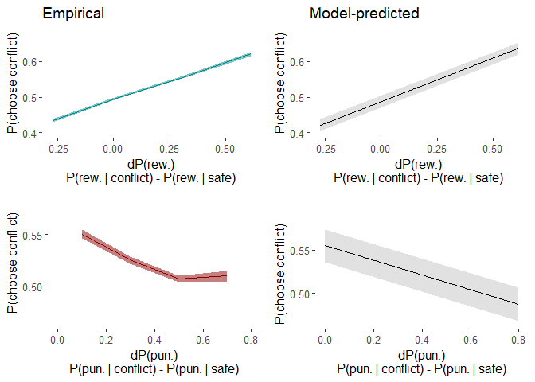<!-- -->

This shows us that across trials, participants chose (i.e. approached)
the option with relatively higher reward probability, and at the same
time, they avoided the conflict option when it was more likely to
produce the punishment.

### Task-induced anxiety

After participants completed the task, we asked them the question: ‘How
anxious did you feel during the task?’. This gave us a measure of
task-induced anxiety. Here is the distribution of scores.

``` r
task_data %>% 
  distinct(subject_nr, anxiety) %>% 
  ggplot(aes(anxiety)) + 
  geom_histogram(bins = 25) + 
  labs(x = 'Task-induced anxiety', y = 'Count')
```

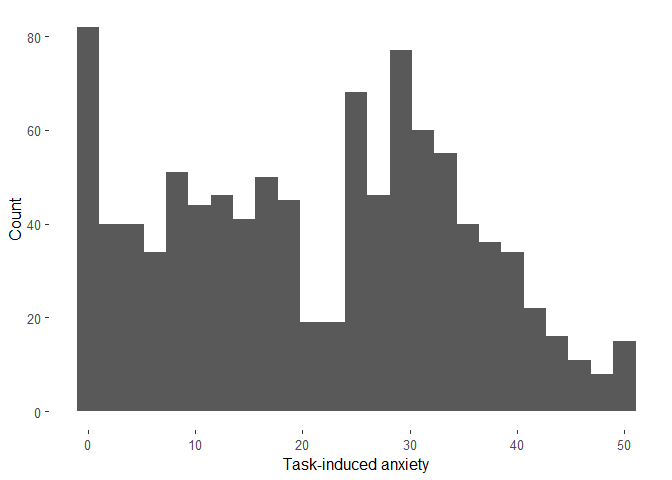<!-- -->

### Correlation of anxiety and choice

Did task-induced anxiety affect choices? We initially tested this via a
permutation-based non-parametric correlation test:

``` r
task_data %>% 
  filter(study == 'disc') %>% 
  group_by(subject_nr) %>% 
  summarise(
    anxiety = unique(anxiety),
    choose_conflict = mean(choice == 1)
  ) %>% 
  summarise(
    tau = cor(anxiety, choose_conflict, method = 'kendall') %>% round(3),
    p_permutation = perm.relation(anxiety, choose_conflict, method = 'kendall', R = 10^4) %>% pluck('p.value') %>% round(3)
  ) %>% 
  mutate(sig = case_when(
    p_permutation < 0.001 ~ '***',
    p_permutation < 0.01 ~ '**',
    p_permutation < 0.05 ~ '*',
    TRUE ~ 'ns', 
  ))
```

    ## # A tibble: 1 × 3
    ##      tau p_permutation sig  
    ##    <dbl>         <dbl> <chr>
    ## 1 -0.074         0.032 *

We see that task-induced anxiety was associated with fewer choices of
the conflict option. Here is the scatterplot of this effect:

``` r
task_data %>% 
  filter(study == 'disc') %>% 
  group_by(subject_nr) %>% 
  summarise(p_conflict = mean(choice == 1), anxiety = unique(anxiety)) %>% 
  ggplot(aes(anxiety, p_conflict)) + 
  geom_point(alpha = 1/2) + 
  geom_smooth(method = 'lm', colour = myColours[2], fill = myColours[2]) + 
  labs(x = 'Task-induced anxiety', y = 'P(choose conflict)') + 
  theme(aspect.ratio = 1)
```

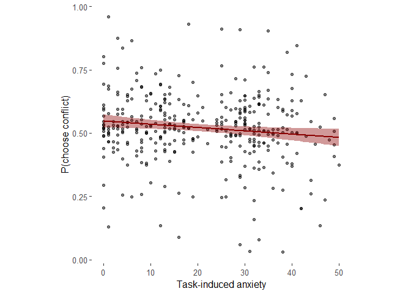<!-- -->

### Anxiety and choice regression

To get a more detailed understanding of the effect of anxiety on
choices, we included task-induced anxiety as a predictor into the
hierarchical regression, specified as the following:

$choice \sim \delta P(Reward) + \delta P(Punishment) + Anxiety + \\ Anxiety\cdot\delta P(Reward) + Anxiety\cdot\delta P(Punishment) + (1 | participant)$

``` r
log_lme_choice_anx <-
  task_data %>%
  filter(study == 'disc') %>%
  left_join(walks) %>%
  mutate(
    d_p_reward = rew_conf - rew_safe,
    d_p_punish = pun_conf - pun_safe,
    approach = as.numeric(choice == 1),
    anxiety = scale(anxiety) # scale predictors for model identifiability
  ) %>%
  glmer(approach ~ (d_p_reward + d_p_punish) * anxiety + (1 | subject_nr), data = .,
        family = 'binomial', glmerControl(optimizer = "bobyqa", optCtrl = list(maxfun = 10^5)))

parameters(log_lme_choice_anx)
```

    ## # Fixed Effects
    ## 
    ## Parameter            | Log-Odds |   SE |         95% CI |     z |      p
    ## ------------------------------------------------------------------------
    ## (Intercept)          |     0.09 | 0.04 | [ 0.01,  0.16] |  2.29 | 0.022 
    ## d p reward           |     0.98 | 0.03 | [ 0.92,  1.05] | 31.33 | < .001
    ## d p punish           |    -0.34 | 0.04 | [-0.42, -0.25] | -7.83 | < .001
    ## anxiety              |    -0.04 | 0.04 | [-0.11,  0.04] | -0.93 | 0.354 
    ## d p reward × anxiety |    -0.06 | 0.03 | [-0.12,  0.01] | -1.80 | 0.072 
    ## d p punish × anxiety |    -0.10 | 0.04 | [-0.19, -0.02] | -2.41 | 0.016 
    ## 
    ## # Random Effects
    ## 
    ## Parameter                  | Coefficient
    ## ----------------------------------------
    ## SD (Intercept: subject_nr) |        0.65

There was a significant interaction between task-induced anxiety and
punishment probability.

Here are the results as a coefficient plot, as in the paper:

``` r
log_lme_choice_anx %>% 
  get_model_data('est', transform = NULL) %>% 
  mutate(
    term = c(
      'P(reward | conflict) - P(reward | safe)',
      'P(punishment | conflict) - P(punishment | safe)',
      'Task-induced anxiety',
      'Task-induced anxiety x\nP(reward | conflict) - P(reward | safe)',
      'Task-induced anxiety x\nP(punishment | conflict) - P(punishment | safe)'
    ) %>% 
      as_factor(),
    term = fct_reorder(term, -row_number()),
    f = c('1', '2', '3', '3', '2')
  ) %>% 
  ggplot(aes(estimate, term)) + 
  geom_point(aes(colour = f), size = 2) + 
  geom_linerange(aes(colour = f, group = estimate, xmin = conf.low, xmax = conf.high)) + 
  geom_vline(xintercept = 0, alpha = 1/2, linetype = 3) + 
  geom_text(aes(label = p.stars), nudge_y = 0.15, size = 4) + 
  annotate(
    "segment", x = 0.05, xend = 0.45, y = 0.4, yend = 0.4,
    arrow = arrow(length = unit(.2,"cm")), alpha = 1/2
  ) + 
  annotate(
    "segment", x = -0.05, xend = -0.45, y = 0.4, yend = 0.4,
    arrow = arrow(length = unit(.2,"cm")), alpha = 1/2
  ) + 
  annotate('text', x =  0.25, y = 0.7, label = 'Conflict option', size = 3.5, alpha = 1/2) + 
  annotate('text', x = -0.25, y = 0.7, label = 'Safe option',     size = 3.5, alpha = 1/2) + 
  scale_x_continuous(breaks = seq(-0.5, 1, by = 0.5), labels = seq(-0.5, 1, by = 0.5), limits = c(-0.5, 1.1)) +
  scale_y_discrete(expand = expansion(add = c(0.8, 0.3))) + 
  scale_colour_manual(values = c(myColours[1], myColours[2], 'grey20')) + 
  labs(x = 'Log odds ratio', y = 'Predictor', title = 'Logistic regression on choice') + 
  theme(
    axis.title.x = element_text(size = 9),
    plot.title = element_text(hjust = 0.1),
    plot.title.position = 'plot',
    axis.text.y = element_text(hjust = 0, size = 9.5),
    legend.position = 'none'
  )
```

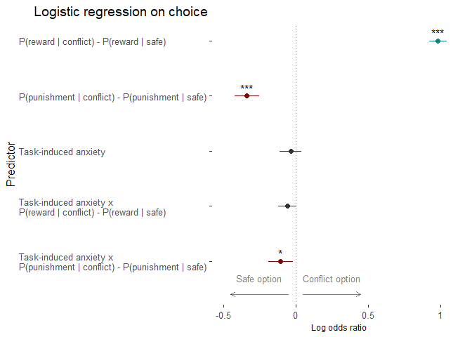<!-- -->

To understand this effect, we can see the effect of punishment
probability on choices, by comparing across different levels of
task-induced anxiety (for visualisation, split into three quantile
groups):

``` r
ggarrange(
  task_data %>% 
    filter(study == 'disc') %>% 
    left_join(walks) %>% 
    mutate(
      d_p_reward = rew_conf - rew_safe,
      d_p_punish = pun_conf - pun_safe,
      choose_conflict = as.numeric(choice == 1)
    ) %>%     
    ungroup %>% 
    mutate(
      g = Hmisc::cut2(anxiety, g = 3),
      pun = cut(d_p_punish, 4),
      i = as.numeric(pun) * 0.2 - 0.1
    ) %>% 
    group_by(g, i, pun) %>% 
    summarise(mean_se(choose_conflict)) %>% 
    ggplot(aes(i, y, group = g)) + 
    geom_ribbon(aes(ymin = ymin, ymax = ymax, fill = g), alpha = 1/2) + 
    geom_line(aes(colour = g), show.legend = F) + 
    scale_colour_manual(
      values = magma(10)[c(3, 5, 8)],
      aesthetics = c('colour', 'fill'),
      labels = c('Low', 'Medium', 'High')
    ) + 
    labs(
      x = 'dP(pun.)\nP(pun. | conflict) - P(pun. | safe)',
      y = 'P(choose conflict)',
      fill = 'Task-induced\nanxiety',
      title = 'Empirical'
    ),
  plot_model(log_lme_choice_anx, 'pred', terms = c('d_p_punish [0, 0.8]', 'anxiety')) + 
    scale_colour_manual(
      values = magma(10)[c(3, 5, 8)],
      aesthetics = c('colour', 'fill'),
      labels = c('Low', 'Medium', 'High')
    ) + 
    labs(
      x = 'dP(pun.)\nP(pun. | conflict) - P(pun. | safe)',
      y = 'P(choose conflict)',
      colour = 'Task-induced\nanxiety',
      title = 'Model-predicted'
    ),
  nrow = 1, common.legend = TRUE
)
```

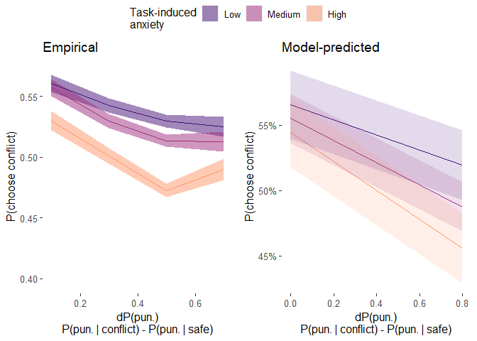<!-- -->

This shows us that more anxious individuals were proportionately less
willing to choose the conflict option during times it was likely to
produce the punishment, relative to less-anxious individuals.

Overall, this suggests that anxiety is associated with greater
tendencies to avoid during approach-avoidance reinforcement learning.

## Computational modelling

We investigated the putative cognitive mechanisms driving behaviour on
the task by fitting standard reinforcement learning models to
trial-by-trial choices. The winning model included reward- and
punishment-specific learning rates ($\alpha^R$, $\alpha^P$), and reward-
and punishment-specific sensitivities ($\beta^R$, $\beta^P$). Briefly,
it models participants as learning four values, which represent the
probabilities of observing each outcome (reward/punishment) for each
option (conflict/safe). At every trial, the probability estimates for
the chosen option are updated after observing the outcome(s) according
to the Rescorla-Wagner update rule. Individual differences in the rate
of updating are captured by the learning rate parameters, whereas
differences in the extent to which each outcome impacts choice are
captured by the sensitivity parameters

The models were fitted using a hierarchical Bayesian approach,
specifically with an expectation maximisation algorithm, via the ‘emfit’
package by Quentin Huys (<https://github.com/mpc-ucl/emfit>) in MATLAB.
The scripts for model fitting can be found online at
<https://osf.io/8dm95>.

### Parameter distribution

Here are the individual-level parameters for the four parameters of the
winning model.

``` r
list(
  # Learning rate
  params %>% 
    filter(study == 'disc') %>% 
    select(contains('alpha')) %>% 
    pivot_longer(everything(), names_prefix = 'alpha.') %>% 
    mutate(
      valence = ifelse(name == 'rew', 'Reward', 'Punishment') %>% fct_relevel('Reward'),
      value = 1/(1 + exp(- value))
    ) %>% 
    ggplot(aes(valence, value)) + 
    labs(x = '', y = 'Learning rate'),
  # Sensitivity
  params %>% 
    filter(study == 'disc') %>% 
    select(contains('beta')) %>% 
    pivot_longer(everything(), names_prefix = 'beta.') %>% 
    mutate(
      valence = ifelse(name == 'rew', 'Reward', 'Punishment') %>% fct_relevel('Reward'),
      value = exp(value)
    ) %>% 
    ggplot(aes(valence, value)) + 
    scale_y_continuous(trans = 'log10') + 
    labs(x = '', y = 'Sensitivity (log scale)')
) %>% 
  map(
    ~ .x + 
      geom_jitter(aes(colour = valence), alpha = 0.8, show.legend = F) + 
      geom_boxplot(width = 0.2, alpha = 0.8, outlier.alpha = 0) + 
      scale_colour_manual(values = myColours)
  ) %>% 
  cowplot::plot_grid(plotlist = ., nrow = 1)
```

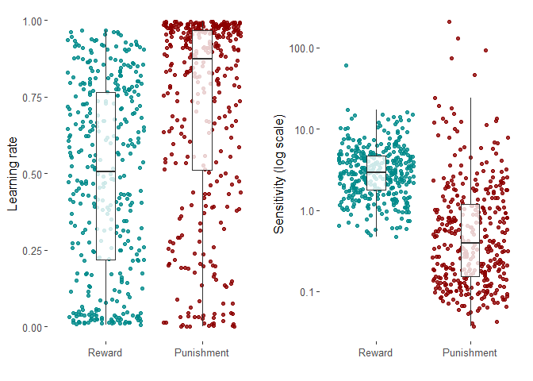<!-- -->

### Posterior predictive checks

To assess how well this model captured our observed data, we simulated
data from the model given each participant’s parameter values, choices
and observed outcomes. These synthetic choice data were qualitatively
similar to the actual choices made by the participants

First, we can check the individual level fits.

``` r
ppc_data %>% 
  filter(
    subject_nr %in% sample(unique(ppc_data$subject_nr), 5),
    trial <= 200
  ) %>% 
  mutate(
    outcome = case_when(
      reward & !punish ~ 'Reward',
      !reward & punish ~ 'Punish',
      reward & punish ~ 'Both',
      T ~ 'None'),
    choose_conflict = as.numeric(choice == 1)  
  ) %>% 
  mutate(Model = '') %>% 
  ggplot(aes(trial)) + 
  facet_wrap(~ subject_nr, ncol = 1, strip.position = 'right') + 
  geom_point(aes(y = choose_conflict, colour = outcome), alpha = 1/2) + 
  geom_path(aes(y = Pa_model, linetype = Model), alpha = 1/2) + 
  scale_colour_manual(
    breaks = c('Reward', 'Punish', 'Both', 'None'),
    values = c(myColours[1], myColours[2], 'orange', 'Grey80')
  ) +
  scale_linetype_manual(values = 1) + 
  labs(x = 'Trial', y = 'P(choice = conflict)')
```

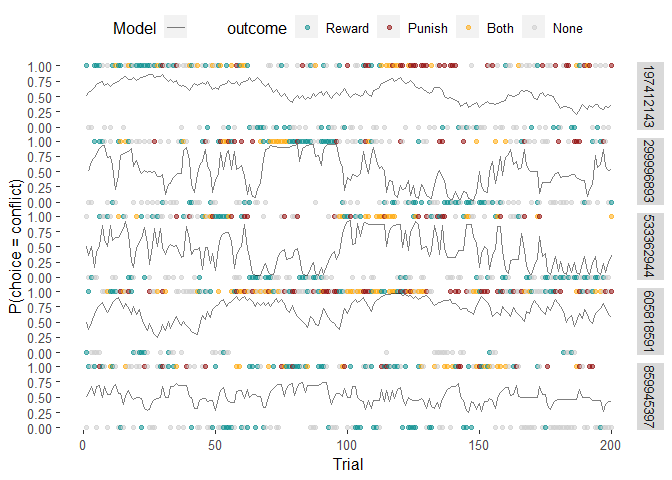<!-- -->

Each row shows the data from a participant, with trials on the x-axis,
coloured points on the top of each plot indicating a conflict option
choice, points on the bottom indicating a safe option choice, and the
curves representing the model’s probability of choosing the
conflict/safe option. A good model fit would show a close correspondence
with the curve and points, which is what we see for these example
participants.

------------------------------------------------------------------------

We can also see how well the model predicts group-level choices.

``` r
ppc_data %>%
  filter(study == 'disc') %>%
  rename(Data = choice, Model = Pa_model) %>%
  mutate(Data = 2 - Data) %>% 
  pivot_longer(c(Data, Model)) %>%
  group_by(name, walk, trial) %>%
  summarise(mean_se(value)) %>%
  filter(trial <= 200) %>%
  ggplot(aes(trial, y)) +
  facet_wrap(~ walk, labeller = label_both) + 
  geom_line(aes(group = name, colour = name), alpha = 3/4) +
  geom_ribbon(aes(group = name, fill = name, ymin = ymin, ymax = ymax), alpha = 1/3, show.legend = F) +
  scale_colour_manual(
    values = c('black', '#C95934'),
    aesthetics = c('colour', 'fill'),
    labels = c('Observed', 'Synthetic')
  ) +
  labs(x = 'Trial', y = 'P(choose conflict)', colour = '', subtitle = 'Posterior predictive checks') +
  theme(legend.position = 'top')
```

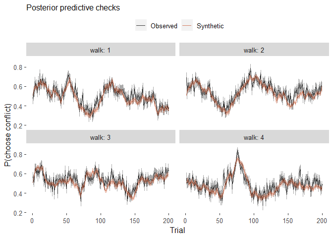<!-- -->

The model (orange) nicely recapitulates the group-trends in
approach-avoidance behaviour in the data (black) over trials!

------------------------------------------------------------------------

Finally, we can see how well the model predicts the overall effect of
approach-avoidance, via the proportion of conflict choices made.

``` r
ppc_data %>%
  filter(study == 'disc') %>%
  rename(Data = choice, Model = Pa_model) %>% 
  mutate(Data = 2 - Data) %>% 
  pivot_longer(c(Data, Model), names_to = 'agent') %>%
  group_by(subject_nr, agent) %>%
  summarise(approach = mean(value)) %>%
  pivot_wider(names_from = agent, values_from = approach) %>%
  ggplot(aes(Data, Model)) + 
  geom_point(alpha = 1/2) +
  geom_abline(intercept = 0, slope = 1, linetype = 2, alpha = 1/2) +
  annotate('text', x = 0.6, y = 0.2, label = 'R = 0.97', size = 5) +
  labs(x = 'Observed proportion of\nconflict option choices', y = 'Synthetic proportion of\nconflict option choices') +
  lims(x = 0:1, y = 0:1) + 
  coord_fixed()
```

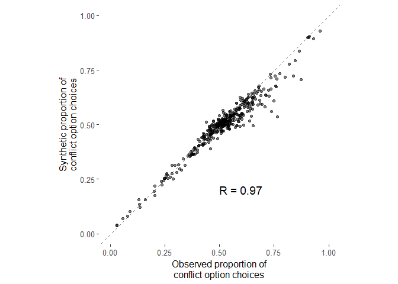<!-- -->

The model faithfully recovers overall biases to approach or to avoid
across the experiment at an individual level.

### A computational measure of approach-avoidance bias

To quantify individual approach-avoidance bias computationally, we
calculated the ratio between the reward and punishment sensitivity
parameters ($\beta^r / \beta^p$). As the task requires simultaneously
balancing reward pursuit (i.e., approach) and punishment avoidance, this
composite measure provides an index of where an individual lies on the
continuum of approach vs avoidance, with higher and lower values
indicating approach and avoidance biases, respectively. We refer to this
measure as the ‘reward-punishment sensitivity index’.

``` r
params %>% 
  filter(study == 'disc') %>% 
  # the beta.rew and beta.pun are in log space
  # subtracting these values gives us the log reward-punishment sensitivity index
  mutate(RPSI = beta.rew - beta.pun) %>% 
  ggplot(aes(x = RPSI, y = ..count.., fill = ..x..)) +
  geom_histogram(show.legend = FALSE) +
  scale_fill_gradient2(name = "val", high = myColours[1], mid = myColours[3], low = myColours[2]) + 
  labs(x = 'Reward-punishment sensitivity index', y = 'Count') +
  annotate('text', x = c(4.25, -2.75), y = 37, label = c('Approach', 'Avoid'), colour = myColours[1:2]) +
  annotate(
    "segment", x = c(3.5, -2), xend = c(5, -3.5), y = 35, yend = 35,
    arrow = arrow(length = unit(.2,"cm")), colour = myColours[1:2]
  )
```

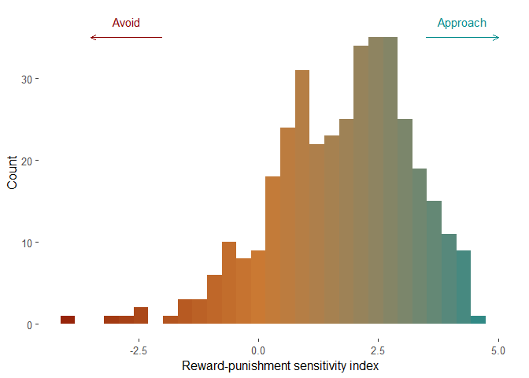<!-- -->

More positive values of the reward-punishment sensitivity index imply
that the reward has a greater impact on choices relative to the
punishment (and conversely, more negative values imply that the
punishment has relatively greater impact on choices). This was evident
in our data, since the reward-punishment sensitivity index was strongly
correlated with the model-agnostic measure of approach-avoidance
(i.e. the overall proportion of conflict option choices).

``` r
task_data %>% 
  filter(study == 'disc') %>% 
  group_by(subject_nr) %>% 
  summarise(choice = mean(choice == 1)) %>% 
  left_join(params %>% mutate(RPSI = beta.rew - beta.pun)) %>% 
  ggplot(aes(RPSI, choice)) + 
  geom_point(alpha = 1/2) + 
  geom_smooth(method = 'lm', colour = myColours[2], fill = myColours[2]) + 
  stat_cor() +
  theme(aspect.ratio = 1) + 
  labs(x = 'Reward-punishment sensitivity index', y = 'P(choose conflict)')
```

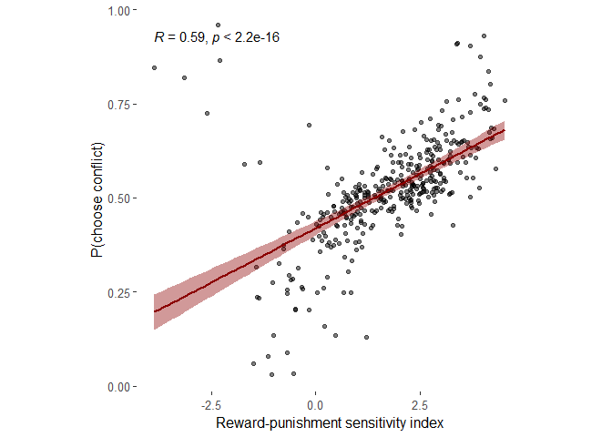<!-- -->

### Anxiety and parameter correlations

We then investigated whether any of the computational model parameters,
including the reward-punishment sensitivity index (RPSI), correlated
with task-induced anxiety.

``` r
params %>% 
  filter(study == 'disc') %>% 
  mutate(RPSI = beta.rew - beta.pun) %>% 
  pivot_longer(c(contains('.'), RPSI), names_to = 'par') %>% 
  left_join(task_data %>% distinct(subject_nr, anxiety)) %>% 
  group_by(par) %>% 
  summarise(
    tau = cor(anxiety, value, method = 'kendall') %>% round(3),
    p_permutation = perm.relation(anxiety, value, method = 'kendall', R = 10^4) %>% pluck('p.value') %>% round(3)
  ) %>% 
  mutate(sig = case_when(
    p_permutation < 0.001 ~ '***',
    p_permutation < 0.01 ~ '**',
    p_permutation < 0.05 ~ '*',
    TRUE ~ 'ns', 
  ))
```

    ## # A tibble: 5 × 4
    ##   par          tau p_permutation sig  
    ##   <chr>      <dbl>         <dbl> <chr>
    ## 1 RPSI      -0.099         0.005 **   
    ## 2 alpha.pun -0.088         0.011 *    
    ## 3 alpha.rew -0.019         0.593 ns   
    ## 4 beta.pun   0.068         0.052 ns   
    ## 5 beta.rew  -0.038         0.286 ns

The punishment learning rate and reward-punishment sensitivity index
were significantly associated with anxiety. Here are the scatter plots
of these effects:

``` r
list(
  # alpha.pun
  params %>% 
    filter(study == 'disc') %>% 
    left_join(task_data %>% distinct(subject_nr, anxiety)) %>% 
    ggplot(aes(anxiety, alpha.pun)) + 
    labs(x = 'Task-induced anxiety', 
         y = expression('Punishment learning rate, '*alpha^'p')),
  # RPSI
  params %>% 
    filter(study == 'disc') %>% 
    mutate(RPSI = beta.rew - beta.pun) %>% 
    left_join(task_data %>% distinct(subject_nr, anxiety)) %>% 
    ggplot(aes(anxiety, RPSI)) + 
    labs(x = 'Task-induced anxiety', 
         y = expression(paste('Reward-punishment sensitivity index, '*beta^'r', '/', beta^'p')))
) %>% 
  map(
    ~ .x + 
      geom_point(alpha = 1/2) + 
      geom_smooth(method = 'lm', colour = myColours[2], fill = myColours[2]) + 
      theme(
        plot.subtitle = element_text(size = 10),
        plot.title    = element_text(size = 12),
        axis.title.x  = element_text(margin = margin(t = 10)),
        axis.title.y  = element_text(margin = margin(t = 0)),
        aspect.ratio  = 1
      )
  ) %>% 
  cowplot::plot_grid(plotlist = ., rel_widths = c(1, 1, 0.1), nrow = 1, axis = 'tb', align = 'vh')
```

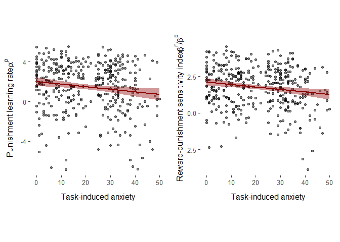<!-- -->

### Mediation analyses

To investigate the cognitive processes underlying anxiety-related
avoidance, we tested for potential mediators of the effect of
task-induced anxiety on avoidance choices in the approach-avoidance
reinforcement learning task. We did this via structural equation
modelling, treating the two significant computational correlates of
anxiety (punishment learning rate and reward-punishment sensitivity
index) as potential parallel mediators of anxiety’s effect on
approach-avoidance choices.

``` r
sem_mediation = 
  sem(
    model = 
      ' avoidance ~ c * anxiety + b1 * RPSI + b2 * alpha.pun
      RPSI ~ a1 * anxiety
      alpha.pun  ~ a2 * anxiety
      RPSI ~~ alpha.pun
      med1   := (a1*b1)
      med2   := (a2*b2)
      direct := c
      total  := c + (a1*b1) + (a2*b2)',
    data = 
      task_data %>% 
      filter(study == 'repl') %>% 
      group_by(subject_nr) %>% 
      summarise(
        anxiety = unique(anxiety),
        choose_conflict = mean(choice == 1)
      ) %>% 
      left_join(params %>% mutate(RPSI = beta.rew - beta.pun)) %>% 
      ungroup %>% 
      mutate(
        avoidance = 1 - choose_conflict,
        RPSI = 1 - RPSI
      ),
    std.ov = TRUE
  )

parameterEstimates(sem_mediation) %>% 
  filter(label != '') %>% 
  select(lhs, op, rhs, label, est, se, pvalue)
```

    ##         lhs op               rhs  label    est    se pvalue
    ## 1 avoidance  ~           anxiety      c  0.001 0.002  0.609
    ## 2 avoidance  ~              RPSI     b1  0.763 0.038  0.000
    ## 3 avoidance  ~         alpha.pun     b2  0.086 0.037  0.021
    ## 4      RPSI  ~           anxiety     a1  0.011 0.003  0.000
    ## 5 alpha.pun  ~           anxiety     a2 -0.006 0.003  0.044
    ## 6      med1 :=           (a1*b1)   med1  0.009 0.002  0.000
    ## 7      med2 :=           (a2*b2)   med2 -0.001 0.000  0.129
    ## 8    direct :=                 c direct  0.001 0.002  0.609
    ## 9     total := c+(a1*b1)+(a2*b2)  total  0.009 0.003  0.002

This can be a bit confusing and difficult to interpret, so here is a
visual illustration of the mediation model (made in Biorender -
<https://biorender.com/>):  


We found that the reward-punishment sensitivity index significantly
mediated the effect of anxiety on choices, whereas this effect was not
significant for the punishment learning rate.

## Symptom effects

We assessed the clinical potential of the novel measure by investigating
how model-agnostic and computational indices of behaviour correlate with
self-reported psychiatric symptoms of anxiety, depression and
experiential avoidance; the latter indexes an unwillingness to
experience negative emotions/experiences (Hayes et al., 1996). We
included experiential avoidance as a direct measure of avoidance
symptoms/beliefs, given that our task involved avoiding stimuli inducing
negative affect.

### Symptoms and task-induced anxiety

Did psychiatric symptoms correlate with task-induced anxiety?

``` r
task_data %>% 
  filter(study == 'disc') %>% 
  distinct(subject_nr, anxiety, BEAQ, GAD, PHQ) %>% 
  pivot_longer(BEAQ:PHQ, names_to = 'scale') %>% 
  group_by(scale) %>% 
  summarise(
    tau = cor(anxiety[!is.na(value)], value[!is.na(value)], method = 'k') %>% round(3),
    p_permutation = 
      perm.relation(
        anxiety[!is.na(value)],
        value[!is.na(value)],
        method = 'kendall',
        R = 10^4
      ) %>% 
      pluck('p.value')
  ) %>% 
  mutate(sig = case_when(
    p_permutation < 0.001 ~ '***',
    p_permutation < 0.01 ~ '**',
    p_permutation < 0.05 ~ '*',
    TRUE ~ 'ns', 
  ))
```

    ## # A tibble: 3 × 4
    ##   scale   tau p_permutation sig  
    ##   <chr> <dbl>         <dbl> <chr>
    ## 1 BEAQ  0.15         0.0002 ***  
    ## 2 GAD   0.256        0.0002 ***  
    ## 3 PHQ   0.233        0.0002 ***

Yes, and all positively so.

### Symptoms and choice

Did psychiatric symptoms predict choices in the task?

``` r
task_data %>% 
  filter(study == 'disc') %>% 
  group_by(subject_nr) %>% 
  summarise(
    choose_conflict = mean(choice == 1),
    across(BEAQ:PHQ, unique)
  ) %>% 
  pivot_longer(BEAQ:PHQ, names_to = 'scale') %>% 
  group_by(scale) %>% 
  summarise(
    tau = cor(choose_conflict[!is.na(value)], value[!is.na(value)], method = 'k') %>% round(3),
    p_permutation = perm.relation(choose_conflict[!is.na(value)], value[!is.na(value)], 'kendall', R = 10^4) %>% pluck('p.value')
  ) %>% 
  mutate(sig = case_when(
    p_permutation < 0.001 ~ '***',
    p_permutation < 0.01 ~ '**',
    p_permutation < 0.05 ~ '*',
    TRUE ~ 'ns', 
  ))
```

    ## # A tibble: 3 × 4
    ##   scale    tau p_permutation sig  
    ##   <chr>  <dbl>         <dbl> <chr>
    ## 1 BEAQ  -0.059         0.092 ns   
    ## 2 GAD   -0.026         0.464 ns   
    ## 3 PHQ   -0.02          0.591 ns

No evidence for these associations.

### Symptoms and parameters

Were psychiatric symptoms associated with parameter differences?

``` r
map_dfr(
  c('BEAQ', 'GAD', 'PHQ'),
  ~ task_data %>% 
    filter(study == 'disc') %>% 
    distinct(subject_nr, BEAQ, GAD, PHQ) %>% 
    pivot_longer(BEAQ:PHQ, names_to = 'scale') %>% 
    filter(scale == .x) %>% 
    left_join(params) %>% 
    mutate(RPSI = beta.rew - beta.pun) %>% 
    pivot_longer(c(contains('.'), RPSI), names_to = 'par', values_to = 'par_value') %>% 
    group_by(par) %>% 
    summarise(
      scale = .x,
      tau = cor(par_value[!is.na(value)], value[!is.na(value)], method = 'k') %>% round(3),
      p_permutation = perm.relation(
        par_value[!is.na(value)],
        value[!is.na(value)],
        method = 'kendall',
        R = 10^4
      ) %>% 
        pluck('p.value')
    ) %>% 
    mutate(sig = case_when(
      p_permutation < 0.001 ~ '***',
      p_permutation < 0.01 ~ '**',
      p_permutation < 0.05 ~ '*',
      TRUE ~ 'ns', 
    ))
)
```

    ## # A tibble: 15 × 5
    ##    par       scale    tau p_permutation sig  
    ##    <chr>     <chr>  <dbl>         <dbl> <chr>
    ##  1 RPSI      BEAQ  -0.081        0.0208 *    
    ##  2 alpha.pun BEAQ  -0.085        0.0174 *    
    ##  3 alpha.rew BEAQ  -0.06         0.0882 ns   
    ##  4 beta.pun  BEAQ   0.072        0.0404 *    
    ##  5 beta.rew  BEAQ  -0.017        0.635  ns   
    ##  6 RPSI      GAD   -0.056        0.118  ns   
    ##  7 alpha.pun GAD   -0.07         0.0548 ns   
    ##  8 alpha.rew GAD   -0.063        0.08   ns   
    ##  9 beta.pun  GAD    0.055        0.121  ns   
    ## 10 beta.rew  GAD   -0.013        0.716  ns   
    ## 11 RPSI      PHQ   -0.061        0.0872 ns   
    ## 12 alpha.pun PHQ   -0.064        0.076  ns   
    ## 13 alpha.rew PHQ   -0.026        0.476  ns   
    ## 14 beta.pun  PHQ    0.051        0.16   ns   
    ## 15 beta.rew  PHQ   -0.024        0.51   ns

Experiential avoidance did positively correlate with the punishment
learning rate, punishment sensitivity and reward-punishment sensitivity
index, **but** none of these correlations replicated an the independent
sample.

``` r
map_dfr(
  c('BEAQ', 'GAD', 'PHQ'),
  ~ task_data %>% 
    filter(study == 'repl') %>% 
    distinct(subject_nr, BEAQ, GAD, PHQ) %>% 
    pivot_longer(BEAQ:PHQ, names_to = 'scale') %>% 
    filter(scale == .x) %>% 
    left_join(params) %>% 
    mutate(RPSI = beta.rew - beta.pun) %>% 
    pivot_longer(c(contains('.'), RPSI), names_to = 'par', values_to = 'par_value') %>% 
    group_by(par) %>% 
    summarise(
      scale = .x,
      tau = cor(par_value[!is.na(value)], value[!is.na(value)], method = 'k') %>% round(3),
      p_permutation = perm.relation(
        par_value[!is.na(value)],
        value[!is.na(value)],
        method = 'kendall',
        R = 10^4
      ) %>% 
        pluck('p.value')
    ) %>% 
    mutate(sig = case_when(
      p_permutation < 0.001 ~ '***',
      p_permutation < 0.01 ~ '**',
      p_permutation < 0.05 ~ '*',
      TRUE ~ 'ns', 
    ))
)
```

    ## # A tibble: 15 × 5
    ##    par       scale    tau p_permutation sig  
    ##    <chr>     <chr>  <dbl>         <dbl> <chr>
    ##  1 RPSI      BEAQ  -0.008         0.767 ns   
    ##  2 alpha.pun BEAQ  -0.027         0.331 ns   
    ##  3 alpha.rew BEAQ  -0.025         0.362 ns   
    ##  4 beta.pun  BEAQ   0.018         0.511 ns   
    ##  5 beta.rew  BEAQ   0.01          0.725 ns   
    ##  6 RPSI      GAD    0.01          0.722 ns   
    ##  7 alpha.pun GAD   -0.015         0.595 ns   
    ##  8 alpha.rew GAD   -0.029         0.28  ns   
    ##  9 beta.pun  GAD    0.003         0.929 ns   
    ## 10 beta.rew  GAD   -0.007         0.797 ns   
    ## 11 RPSI      PHQ    0.017         0.527 ns   
    ## 12 alpha.pun PHQ   -0.014         0.637 ns   
    ## 13 alpha.rew PHQ   -0.036         0.197 ns   
    ## 14 beta.pun  PHQ   -0.002         0.967 ns   
    ## 15 beta.rew  PHQ    0.01          0.723 ns

## Test-retest reliability of the task

We retested a subset of our sample (n = 57) to assess the reliability of
our task. Participants completed the task again, but with a different
set of latent outcome probabilities and new stimuli, to avoid to
practice effects.

We interpreted indices of reliability based on conventional values of \<
0.40 as poor, 0.4 - 0.6 as fair, 0.6 - 0.75 as good, and \> 0.75 as
excellent reliability (Fleiss, 1986).

### Reliability of task-induced anxiety and overall proportion of conflict option choices

We calculated intra-class correlations coefficients (ICCs) to assess the
reliability of our model-agnostic measures. Since the latent outcome
probabilities were different, we opted to use consistency-based
measures.

Here is the ICC for task-induced anxiety:

``` r
trt_data %>% 
  distinct(subject_nr, session, anxiety) %>% 
  pivot_wider(names_from = session, names_prefix = 's', values_from = anxiety) %>% 
  select(- subject_nr) %>% 
  icc(model = 't', type = 'consistency', unit = 'single')
```

    ##  Single Score Intraclass Correlation
    ## 
    ##    Model: twoway 
    ##    Type : consistency 
    ## 
    ##    Subjects = 57 
    ##      Raters = 2 
    ##    ICC(C,1) = 0.676
    ## 
    ##  F-Test, H0: r0 = 0 ; H1: r0 > 0 
    ##    F(56,56) = 5.18 , p = 2.82e-09 
    ## 
    ##  95%-Confidence Interval for ICC Population Values:
    ##   0.506 < ICC < 0.796

… and for the overall proportion of conflict option choices:

``` r
trt_data %>% 
  group_by(subject_nr, session) %>% 
  summarise(choose_conflict = mean(choice == 1)) %>% 
  pivot_wider(names_from = session, names_prefix = 's', values_from = choose_conflict) %>% 
  ungroup %>% 
  select(- subject_nr) %>% 
  icc(model = 't', type = 'consistency', unit = 'single')
```

    ##  Single Score Intraclass Correlation
    ## 
    ##    Model: twoway 
    ##    Type : consistency 
    ## 
    ##    Subjects = 57 
    ##      Raters = 2 
    ##    ICC(C,1) = 0.402
    ## 
    ##  F-Test, H0: r0 = 0 ; H1: r0 > 0 
    ##    F(56,56) = 2.34 , p = 0.000889 
    ## 
    ##  95%-Confidence Interval for ICC Population Values:
    ##   0.16 < ICC < 0.598

Here are the scatter plots of values across time:

``` r
list(
  # Anxiety
  trt_data %>% 
    distinct(subject_nr, session, anxiety) %>% 
    mutate(session = as_factor(session)) %>% 
    pivot_wider(names_from = session, values_from = anxiety, names_prefix = 'val_') %>% 
    ggplot(aes(val_1, val_2)) +
    ggtitle('Task-induced anxiety'),
  # Choices
  trt_data %>% 
    group_by(subject_nr, session) %>% 
    summarise(choose_conflict = mean(choice == 1)) %>% 
    mutate(session = as_factor(session)) %>% 
    pivot_wider(names_from = session, values_from = choose_conflict, names_prefix = 'val_') %>% 
    ggplot(aes(val_1, val_2)) +
    ggtitle('Proportion conflict\noption choices')
) %>% 
  map(
    ~ .x + 
      geom_point(alpha = 0.6, size = 1.4) + 
      geom_abline(slope = 1, intercept = 0, linetype = 2, alpha = 1/2) + 
      geom_smooth(method = 'lm', se = F, alpha = 0.8, colour = myColours[2], fill = myColours[2]) + 
      labs(x = 'Session 1', y = 'Session 2') + 
      theme(
        aspect.ratio  = 1,
        plot.title    = element_text(size = 12),
        plot.subtitle = element_text(size = 10)
      )
  ) %>% 
  cowplot::plot_grid(plotlist = ., nrow = 1, axis = 'tb', align = 'h')
```

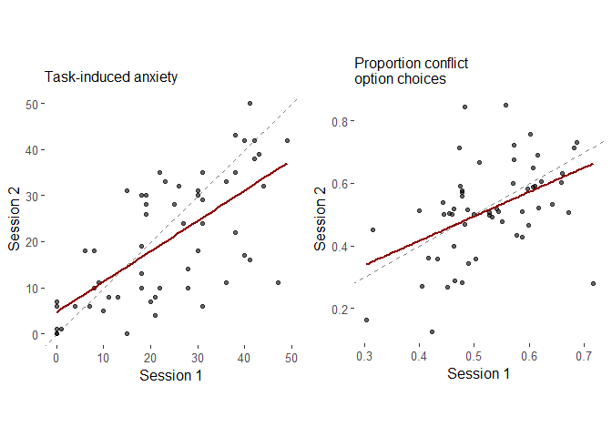<!-- -->

Task-induced anxiety had good reliability, whereas the overall
proportion of choices showed fair reliability.

### Reliability of the model parameters

For the reliability of the model-based measures, we could compute this
directly from their covariance matrix, when the parameters were fitted
together in a joint model (whilst still fitting separate parameters for
each session).

``` r
cov_mat = 
  trt_model %>% 
  pluck('stats', 9)

map(1:4, ~ cov2cor(cov_mat)[.x, .x + 4]) %>% 
  reduce(c) %>% 
  tibble(
    par = c('alpha.rew', 'alpha.pun', 'beta.rew', 'beta.pun'),
    r = .
  )
```

    ## # A tibble: 4 × 2
    ##   par            r
    ##   <chr>      <dbl>
    ## 1 alpha.rew  0.767
    ## 2 alpha.pun -0.453
    ## 3 beta.rew   0.757
    ## 4 beta.pun   0.448

Aside from the punishment learning rate, the parameters have
fair-to-excellent reliability.

To obtain a reliability estimate for the reward-punishment sensitivity
index (RPSI), we need to do a bit of maths (feel free to skip this
section).

Remember that since the sensitivity parameters are fitted in log space,
the (log) RPSI is simply the difference in the untransformed parameter
values for $\beta^R$ and $\beta^P$:

$log (RPSI) = log(\beta^R/\beta^P) = log(\beta^R) - log(\beta^P)$

Given that equation, we can calculate the model-derived Pearson’s
r-value for the (log) RPSI from the cross-session parameter covariance
matrix, based on the following:

$Cor(log(\beta^R_1) - log(\beta^P_1), \ log(\beta^R_2) - log(\beta^P_2)) = \frac {Cov(log(\beta^R_1) - log(\beta^P_1), \ log(\beta^R_2) - log(\beta^P_2))} {\sqrt {Var(log(\beta^R_1) - log(\beta^P_1))} {\sqrt {Var(log(\beta^R_2) - log(\beta^P_2))}}}$

The numerator is given by:

$Cov(log(\beta^R_1) - log(\beta^P_1), \ log(\beta^R_2) - log(\beta^P_2)) = \ ...$

$Cov(log(\beta^R_1), log(\beta^R_2)) - Cov(log(\beta^P_1), log(\beta^R_2)) - Cov(log(\beta^R_1), log(\beta^P_2)) + Cov(log(\beta^P_1), log(\beta^P_2))$

The denominator requires us to calculate the variance of the RPSI,
$Var(log(\beta^R) - log(\beta^P))$, for each session, which can be
calculated via:

$Var(log(\beta^R) - log(\beta^P)) = Var(log(\beta^R)) + Var(log(\beta^P)) + 2Cov(log(\beta^R), log(\beta^R))$

Putting that all together, the model-derived Pearson’s r-value for the
(log) RPSI was therefore:

``` r
(cov_mat[3,7] - cov_mat[3,8] - cov_mat[4,7] + cov_mat[4,8]) / 
  (sqrt(cov_mat[3,3] + cov_mat[4,4] - 2 * cov_mat[3,4]) * sqrt(cov_mat[7,7] + cov_mat[8,8] - 2 * cov_mat[7,8]))
```

    ## [1] 0.4372698

This shows that the RPSI has fair reliability.

Again, here are the scatter plots of values across time:

``` r
list(
  trt_params %>% 
    select(subject_nr, session, alpha.rew) %>% 
    mutate(session = as_factor(session)) %>% 
    pivot_wider(names_from = session, values_from = alpha.rew, names_prefix = 'val_') %>% 
    ggplot(aes(val_1, val_2)) + 
    ggtitle(expression(alpha^'r'), subtitle = 'r = 0.77'),
  trt_params %>% 
    select(subject_nr, session, alpha.pun) %>% 
    mutate(session = as_factor(session)) %>% 
    pivot_wider(names_from = session, values_from = alpha.pun, names_prefix = 'val_') %>% 
    ggplot(aes(val_1, val_2)) + 
    ggtitle(expression(alpha^'p'), subtitle = 'r = -0.45'),
  trt_params %>% 
    select(subject_nr, session, beta.rew) %>% 
    mutate(session = as_factor(session)) %>% 
    pivot_wider(names_from = session, values_from = beta.rew, names_prefix = 'val_') %>% 
    ggplot(aes(val_1, val_2)) + 
    ggtitle(expression(beta^'r'), subtitle = 'r = 0.76'),
  trt_params %>% 
    select(subject_nr, session, beta.pun) %>% 
    mutate(session = as_factor(session)) %>% 
    pivot_wider(names_from = session, values_from = beta.pun, names_prefix = 'val_') %>% 
    ggplot(aes(val_1, val_2)) + 
    ggtitle(expression(beta^'p'), subtitle = 'r = 0.45'),
  trt_params %>% 
    mutate(
      RPSI = beta.rew - beta.pun,
      session = as_factor(session)
    ) %>% 
    select(subject_nr, session, RPSI) %>% 
    pivot_wider(names_from = session, values_from = RPSI, names_prefix = 'val_') %>% 
    ggplot(aes(val_1, val_2)) + 
    ggtitle(expression(paste('RPSI: ' * beta^'r', '/', beta^'p')), subtitle = 'r = 0.44')
) %>% 
  map(
    ~ .x + 
      geom_point(alpha = 0.6, size = 1.4) + 
      geom_abline(slope = 1, intercept = 0, linetype = 2, alpha = 1/2) + 
      geom_smooth(method = 'lm', se = F, alpha = 0.8, colour = myColours[2], fill = myColours[2]) + 
      labs(x = 'Session 1', y = 'Session 2') + 
      theme(
        aspect.ratio  = 1,
        plot.title    = element_text(size = 12),
        plot.subtitle = element_text(size = 10)
      )
  ) %>% 
  cowplot::plot_grid(plotlist = ., nrow = 1, axis = 'tb', align = 'h')
```

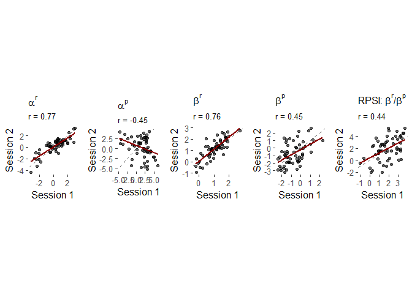<!-- -->
